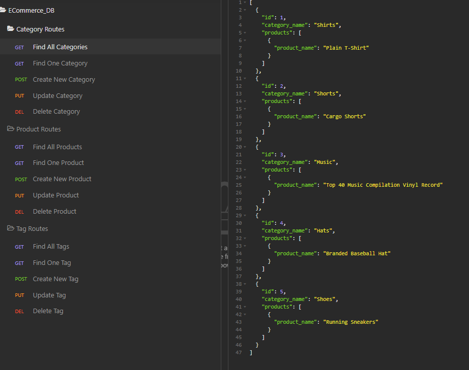

  
  
  # E-Commerce Backend
  

  ## Table Of Contents

  * [Description](#description)

  * [Installation](#installation)

  * [Usage](#usage)

  * [License](#license)

  * [Contributors](#contributors)

  * [Tests](#tests)

  * [ScreenShots](#screenshots)

  * [Links](#links)

  * [Questions](#questions)

  ## Description

  This application creates a MySQL database for the backend of a "Company's" E-Commerece Site. It gives the user the ability to view all categories, products, and tags and its given data values. Users also have the ability to view individual items, add values, update values, and deleting values from the database.
  
  ## Installation

  To run this application properly, you need to install
  *  Node.js  
  *  MySQL2  
  *  Express.js 
  *  Sequelize  
  *  Insomnia (For Testing Purposes)  
  *  dotenv
  

  ## Usage
  
  *  Clone the repository and navigate to the project folder in the Command Line  
  *  Run MySQL with the command: mysql -u root -p
  *  Enter password
  *  Enter Command: db/schema.sql;
  *  Enter Command: quit;
  *  Enter Command: npm install  
  *  Optional (For preset values): Enter Command: npm run seeds  
  *  Enter Command: npm start
  
  
  ## License
  
  This Project is licensed by [MIT](https://choosealicense.com/licenses/mit/).
  
  ## Contributors

  Tom Lazore - Contact Info Below
  
  
  ## Tests
  
  No Tests Availiable Currently

  ## ScreenShot

  

  ## Links

  Live application: No Live Application For This Project

  [Project Repository](https://github.com/tlaze/E-Commerce-Backend)
  
  [Video Walkthrough](https://drive.google.com/file/d/1wjuSyfh78GBak2BMvQl8KWsAblSFl0H5/view)
  
  
  ## Questions

  If you have any questions, comments, or issues feel free to contact Tom directly through
  
  email: tomlazore@gmail.com

  or check out my [GitHub](https://github.com/tlaze)

  
